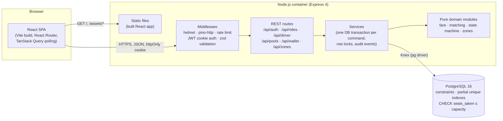
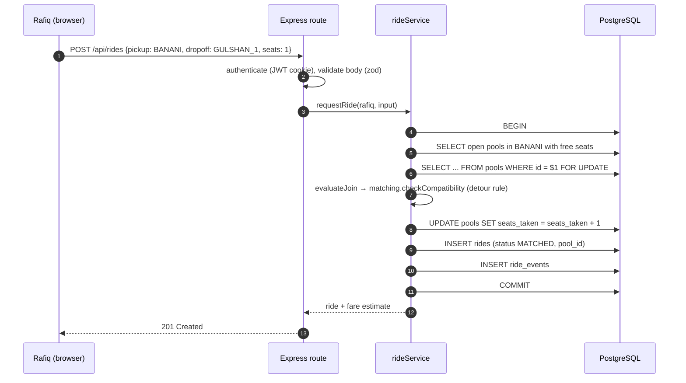
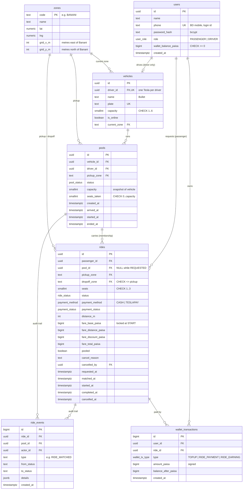
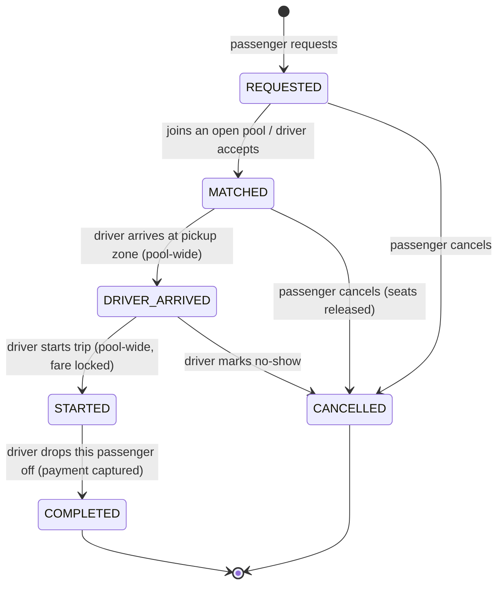
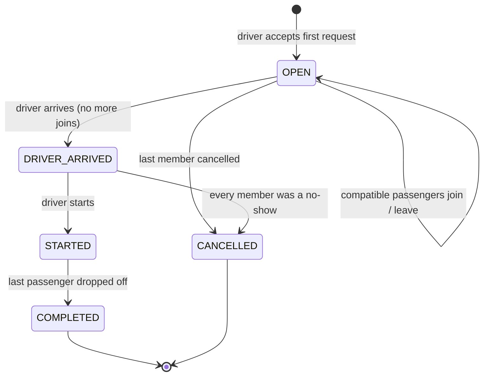
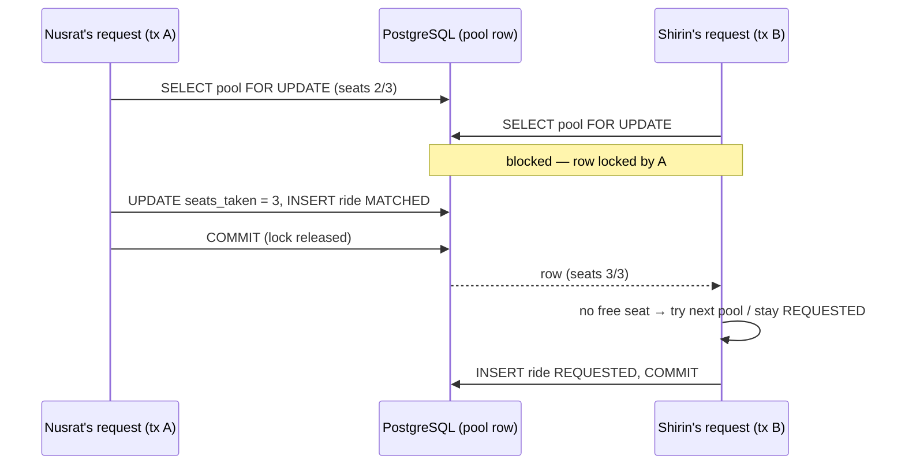

# Architecture

This document was written before the implementation and is kept in sync with it.
Domain rules (zones, matching, fares) live in [domain-rules.md](domain-rules.md);
the scaling discussion lives in [scaling.md](scaling.md).

## 1. System overview

One deployable Node.js service plus one PostgreSQL database. No queues, caches or
microservices: a single Tesla has three seats, and the only hard problem at MVP scale
is keeping those seats consistent, which PostgreSQL does for us.



**Why one container serves both the SPA and the API:** the browser talks to a single
origin, so the auth cookie can be `httpOnly` + `SameSite=Lax` with no CORS and no
third-party-cookie problems, and the free hosting tier only has to run one service.
In development, Vite's dev server proxies `/api` to Express so the topology is the same.

### Request path for a typical command (Rafiq requests a ride)



## 2. Code organisation

```
server/
  src/
    app.js              Express app factory (no listen) — imported by tests
    server.js           boots the app, graceful shutdown
    config/             env parsing (zod) — fail fast on bad config
    db/                 knex instance, transaction helper with retry
    domain/             PURE functions, no I/O: zones, fare, matching, state machine
    services/           business commands; own transactions, locks, events
    routes/             HTTP only: parse → call service → shape response
    middleware/         auth, validation, error handler, rate limiting
    lib/                logger, error classes, money formatting
  migrations/           schema, constraints, indexes (Knex)
  seeds/                the story cast: Jashim, Bullet, Nusrat, Rafiq, Shirin
  tests/                unit (domain) + integration (HTTP + real Postgres)
client/
  src/
    api/                fetch wrapper + typed-ish endpoint functions
    auth/               session context
    components/         shared UI (StatusBadge, FareBreakdown, ZoneMap, ...)
    pages/passenger/    request ride, live status, history, wallet
    pages/driver/       dashboard (online, requests, active pool), history
```

Business rules sit in `domain/` (pure, unit-tested) and `services/` (transactional).
Routes never touch the database directly, and the database never trusts the routes:
the important invariants are also enforced by constraints.

## 3. Database design (ERD)



### Table by table

| Table | Why it exists | Key constraints / indexes |
|---|---|---|
| `users` | Passengers and drivers share login; role decides what they can do. | `phone` unique; `role` enum; `wallet_balance_paisa >= 0` so a wallet can never go negative even if a bug slips through. |
| `zones` | Reference data for the predefined Dhaka areas. Lets rides/pools use real foreign keys instead of free text. | PK `code`; grid coordinates are what the fare and matching rules use. |
| `vehicles` | The Tesla (Bullet) with a fixed capacity; also holds driver availability (`is_online`, `current_zone`) because the *vehicle* is what is available. | `driver_id` unique (one Tesla per driver), `capacity` CHECK 1..6. |
| `pools` | One physical trip of one Tesla: a pickup zone, a set of passengers, a lifecycle. | `CHECK (seats_taken BETWEEN 0 AND capacity)` — capacity is enforced by the database, not only by code. Partial unique index: **one active pool per vehicle**. |
| `rides` | A passenger's request *and* their pool membership (`pool_id`). Each passenger's own status and own fare live here. | Partial unique index: **one active ride per passenger**. CHECK: `REQUESTED` ⇔ no pool; `MATCHED`..`COMPLETED` ⇒ pool set. CHECK pickup ≠ dropoff. Partial index for the driver feed `(pickup_zone, requested_at) WHERE status = 'REQUESTED'` and history `(passenger_id, requested_at DESC)`. |
| `ride_events` | Append-only audit log: who changed what, from which state to which, when. This is the "explain exactly what happened" history. | Indexed by `(ride_id, created_at)` and `(pool_id, created_at)`. Never updated or deleted by the app. |
| `wallet_transactions` | Ledger for the simulated **TeslaPay** wallet. The balance on `users` is a cached sum, the ledger is the truth. | Partial unique index on `(ride_id, type)` makes charging a ride **idempotent** — a retried drop-off cannot charge Nusrat twice. |

**Why a ride row doubles as pool membership.** A ride belongs to at most one pool,
and a membership has no data of its own that the ride doesn't already have (seats,
dropoff, fare). A separate `pool_members` table would duplicate `seats` and create a
second place for capacity to drift. If a ride were ever reassigned to another Tesla,
the history is preserved in `ride_events`.

**Why money is `bigint` paisa.** Rafiq's pooled fare is ৳67.50. Floating point cannot
represent every decimal exactly and rounding errors accumulate across a ledger; `numeric`
would be correct but arrives in Node as a string and invites accidental float math.
Integer paisa is exact, fast, and trivially summed. `pg` returns `bigint` as a string, so
the app registers a parser that converts it to a JS number (safe up to ~9×10¹³ taka).
Formatting to "৳67.50" happens only at the edges (the `display` object in API responses, and the UI).

## 4. Lifecycle (state machines)

The PRD suggests `REQUESTED → MATCHED/ACCEPTED → DRIVER_ARRIVED → STARTED → COMPLETED (+ CANCELLED)`.
We keep those names but split them over **two state machines**, because a pooled
trip has two different things moving through time: the Tesla and each passenger.

### Ride (per passenger)



### Pool (per Tesla trip)



### What we changed from the suggested lifecycle and why

1. **Two machines instead of one.** Nusrat gets off at Mohakhali before Rafiq reaches
   Gulshan 1. With a single ride status, either Nusrat's ride stays "in progress" after
   she has left, or Rafiq's ride is "completed" while he is still in the Tesla. Per-passenger
   `COMPLETED` (drop-off) fixes this and is also the moment her payment is captured.
2. **Pool-wide arrival and start.** Everyone in a pool boards in the same pickup zone
   (see matching rule), so Jashim taps "Arrived" and "Start" once, and it cascades to every member.
3. **Joins close at `DRIVER_ARRIVED`.** Once Jashim is waiting at Banani Road 11, holding
   the Tesla for a stranger who has not requested yet makes everyone late.
4. **Fare locked at `STARTED`.** Whether a ride is "pooled" is only certain when the Tesla
   leaves; if Rafiq cancels before that, Nusrat should not be charged a pooled price for a
   solo ride, and vice versa. Before start, the UI shows a live estimate.
5. **Cancellation rules** (enforced in `domain/stateMachine.js` and re-checked inside the transaction):
   - Passenger may cancel while `REQUESTED` or `MATCHED`. Seats return to the pool.
   - After `DRIVER_ARRIVED` the passenger can no longer cancel in-app; the driver resolves it
     by marking a **no-show**. This avoids a "cancel while boarding" race with *Start*, and the
     seat may already have been refused to someone else. (A late-cancellation fee is a listed next improvement.)
   - Nobody can cancel a `STARTED` ride; it ends with a drop-off.
   - If a pool loses its last member before start, the pool is `CANCELLED` and Bullet is free again.

Every transition is a named command endpoint (`POST /api/pools/:id/start`), never a generic
`PATCH {status}`, so the server owns the state machine and the client cannot "jump" states.

## 5. Consistency and the concurrency problem

**Scenario:** Bullet has one free seat. Nusrat and Shirin both request at nearly the same
instant; both reads see `seats_taken = 2, capacity = 3`.

**How the MVP handles it — three layers:**

1. **Row lock per pool.** Every command that changes a pool runs in one transaction and
   starts with `SELECT … FROM pools WHERE id = $1 FOR UPDATE`. The second transaction blocks
   until the first commits, then re-reads `seats_taken = 3`, sees no room, and moves on
   (Shirin's ride stays `REQUESTED`, waiting for another Tesla).
2. **Re-validation after the lock.** All checks (status is `OPEN`, free seats, detour rule
   against the *current* members) happen after the lock is taken — never on the stale read.
3. **Database constraint.** `CHECK (seats_taken <= capacity)` means that even a future bug
   that forgets the lock produces an error, not an overbooked Tesla.



**Lock ordering.** To avoid deadlocks every command locks in the same order:
`vehicle → pool → ride` (driver commands lock the vehicle first; passenger commands never touch it). Deadlocks or serialization failures (`40P01`, `40001`) that still
occur are retried by the transaction helper (up to 3 attempts), then surface as `503`.

**Other races covered the same way:** two drivers accepting the same request (ride row is
locked and must still be `REQUESTED`), a passenger cancelling while the driver accepts,
double-tapping *Drop off* (ride must still be `STARTED`; the payment ledger has a unique
key), a passenger opening two requests in two tabs (partial unique index on active rides).

**At larger scale** see [scaling.md](scaling.md): partition by pickup zone, move matching
into a per-zone worker that owns seat assignment, and use idempotency keys on all commands.

## 6. API overview

REST + JSON. REST fits because the domain is a small set of resources (rides, pools,
wallet) with a few explicit commands; GraphQL's flexible querying buys nothing here and
makes authorisation per field harder. All responses use `{ data }` or
`{ error: { code, message, details? } }`.

| Method & path | Who | Purpose |
|---|---|---|
| `POST /api/auth/signup` | public | Passenger sign-up (drivers are onboarded by ops/seed) |
| `POST /api/auth/login` · `POST /api/auth/logout` · `GET /api/auth/me` | any | Session |
| `GET /api/zones` | public | Predefined Dhaka zones |
| `GET /api/fares/estimate?pickup&dropoff&seats` | public | Solo vs pooled estimate |
| `POST /api/rides` | passenger | Request a ride (auto-joins a compatible open pool) |
| `GET /api/rides` · `GET /api/rides/active` · `GET /api/rides/:id` | passenger | History, live ride, detail + timeline |
| `POST /api/rides/:id/cancel` | passenger | Cancel while valid |
| `GET /api/driver/me` | driver | Driver, Tesla, active pool |
| `POST /api/driver/online` · `POST /api/driver/offline` | driver | Availability (+ current zone) |
| `GET /api/driver/requests` | driver | Relevant waiting requests |
| `POST /api/driver/requests/:rideId/accept` | driver | Accept into current pool or open a new one |
| `POST /api/pools/:id/arrive` · `/start` | driver | Pool-wide transitions |
| `POST /api/pools/:id/rides/:rideId/dropoff` · `/no-show` | driver | Per-passenger transitions |
| `GET /api/pools` · `GET /api/pools/:id` | driver | Ride history / pool detail |
| `GET /api/wallet` · `POST /api/wallet/topup` | any · passenger | Simulated TeslaPay (drivers see earnings, only passengers top up) |
| `GET /api/health` | public | Liveness + DB check (used by Docker health check) |

**Authorisation rule of thumb:** a passenger can only see or change rides where
`passenger_id = me`; a driver only pools where `driver_id = me`. Anything else returns
`404` (not `403`) so ride IDs of other people cannot be probed.
