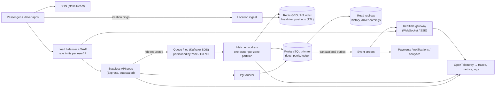

# Bonus: "If Oi Tesla goes viral"

What changes when we go from Jashim and Bullet to **1M passengers and 100k drivers**? This
is reasoning, not a build plan. The MVP deliberately has none of this, because none of it
is needed for one Tesla and three seats.

## 1. Sizing the problem first

| Quantity | Assumption | Load |
|---|---|---|
| Rides | 1M passengers × ~1.5 rides/day | ~1.5M rides/day; peak hour ≈ 15% → **~60 ride requests/s**, bursts to ~300/s (rain, Eid, office rush) |
| Driver location pings | 40% of 100k drivers online at peak, one ping every 5 s | **~8,000 writes/s**, the biggest load by far |
| Status reads | Every active passenger and driver watching a screen | With 3 s polling ≈ 50k req/s, which is why polling has to go (below) |
| Money | Every completed ride settles once | ~60 writes/s, must be exactly-once |

Seat claiming itself is not the bottleneck: it is one row per pool with at most 3 seats.
The hard parts are **location volume**, **hot zones** (Banani at 8:41 AM) and **fan-out of live updates**.

## 2. Target architecture

## 3. Topic by topic

**Load balancing and horizontal scaling.** The API is already stateless (JWT cookie, no
in-memory sessions), so it scales by adding pods behind a load balancer. Autoscale on CPU
and p95 latency. The realtime gateway scales separately because its load is connection
count, not requests.

**Database: indexing, replicas, contention.** Keep PostgreSQL as the source of truth for
rides, pools and the ledger: the capacity CHECK, partial unique indexes and row locks are
exactly the guarantees we don't want to rebuild. Changes at this scale:
- **PgBouncer** in front of Postgres (thousands of pods cannot each hold 10 connections).
- **Read replicas** for history and earnings screens; commands always hit the primary.
- **Partition** `rides` and `ride_events` by month, and archive old partitions to cheap storage.
- The existing indexes (`rides_waiting_feed`, `pools_open_by_zone`, `rides_passenger_history`)
  already match the hot queries. Add `pg_stat_statements` and watch them.
- **Contention:** today every request in Banani scans Banani's open pools and locks them
  one at a time. At rush hour that turns into a queue on a handful of pool rows. The fix is
  to make matching **single-writer per zone** (next point), so row locks become a safety
  net instead of the main mechanism. Short term, `FOR UPDATE SKIP LOCKED` on candidate pools
  lets a request try the next pool instead of waiting.

**Ride matching.** Move matching out of the HTTP request. `POST /rides` stores the
request and publishes `RideRequested` to a queue partitioned by pickup zone (or H3 cell). One
matcher consumer owns each partition, so all decisions for Banani are serialised in memory
without lock fights, and it can batch (look at 2 s of requests together and build better
pools than first-come-first-served). The DB constraints stay as the backstop. The passenger
sees `REQUESTED → MATCHED` through the realtime channel.

**Geospatial search.** Replace the 13 predefined zones with **H3 hexagons** (or PostGIS
for persistent data). Live driver positions go into **Redis GEO / H3 buckets with a TTL**,
never into Postgres rows at 8k writes/s. "Drivers within 4 km" becomes a k-ring lookup.
Real road distance/ETA comes from a routing engine (OSRM self-hosted) and is cached per
cell pair.

**Caching.** Zones/fare rules are static (already cacheable). Cache estimates per
(cell pair, seats) for a minute. Don't cache ride state: correctness beats a stale cache,
and the realtime channel already pushes it.

**Queues and events.** Use a **transactional outbox**: the same DB transaction that changes
a ride writes an `outbox` row (we already write `ride_events` in-transaction; it is almost
an outbox). A relay publishes it to Kafka/SQS. Consumers are notifications (SMS/push
"Jashim has arrived"), the realtime gateway, payments and analytics. This way we never
send "your driver arrived" for a transaction that rolled back.

**Real-time communication.** Replace 3 s polling with **WebSocket or SSE** from the
gateway, subscribed to per-ride and per-pool channels fed by the event stream. Keep polling
as a fallback for bad mobile networks.

**Rate limiting.** At the edge (WAF/LB) per IP, and in the API per user and action. Ride
requests: a few per minute. Location pings: capped per driver. Login: the limiter we have
today, backed by Redis so it works across pods.

**Idempotency.** Every mutating call takes an `Idempotency-Key` header, stored with its
response for 24 h. A retried `POST /rides` after a timeout returns the original ride, and a
double-tapped *Drop off* returns the first result. Today the partial unique indexes and
the ledger's `(ride_id, type)` key give us part of this; keys make it explicit and general.

**Retry and failure strategy.** Clients retry only idempotent calls, with exponential
backoff and jitter. Workers use retries plus a dead-letter queue. Payment provider calls go
through a circuit breaker; if TeslaPay (or a real gateway) is down, the ride still completes
and the payment is settled asynchronously (the saga pattern). Timeouts everywhere, and no
unbounded waits on row locks (`lock_timeout`).

**Observability.** Structured JSON logs with request IDs exist already. Add OpenTelemetry
traces across API → queue → matcher. RED metrics per endpoint, business metrics (match
rate, time-to-match, seats filled per trip, cancellation rate per zone) and SLOs such as
"p99 time from request to MATCHED < 5 s in peak hour". Alert on SLO burn, not on CPU.

**Security.** Short-lived access tokens plus refresh tokens with rotation and revocation;
driver KYC/onboarding workflow; PII (phone numbers) encrypted at rest and masked between
passengers and drivers (proxy calling); a fraud signal on abnormal cancellations or wallet
top-ups; least-privilege DB roles (the app never runs as the schema owner); secrets in a
secret manager; dependency scanning in CI.

**Deployment strategy.** Containers on a managed orchestrator (ECS/Kubernetes: this is the
first point where Kubernetes pays for itself). Blue/green or canary per service. DB
migrations follow **expand → migrate → contract** so old and new pods can run side by side.
Multi-AZ Postgres with automated failover. Feature flags for matching-algorithm changes,
rolled out one zone at a time.

## 4. What I would *not* change

- The two state machines and "transitions are commands, not `PATCH status`".
- Invariants enforced by the database (capacity, one active ride, idempotent ledger).
- Integer paisa.
- The fare being locked at trip start and stored on the ride.

These are the parts that make the system explainable, and scale doesn't make them less true.
